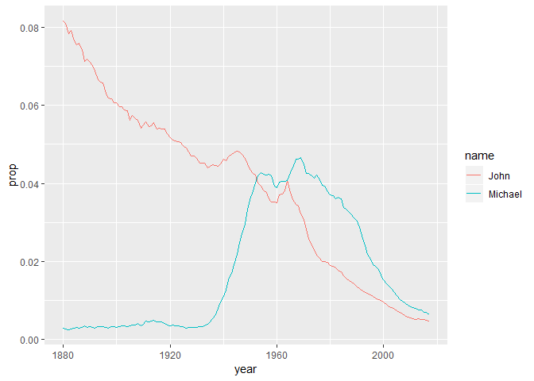
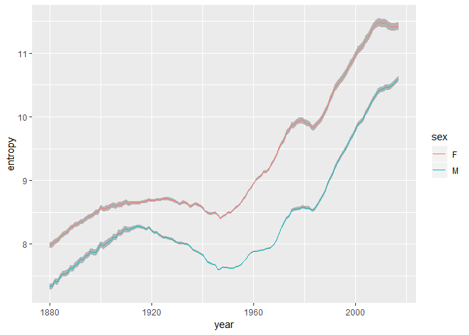
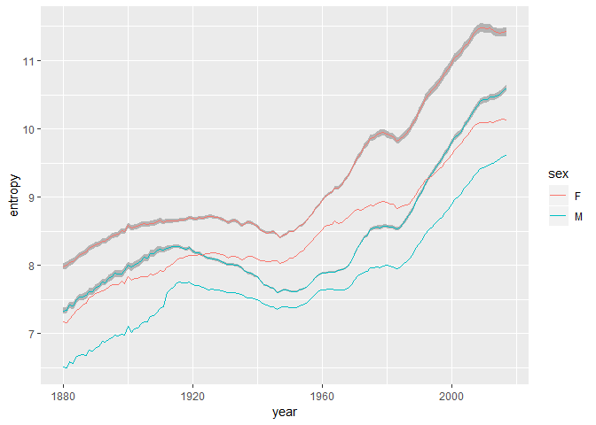
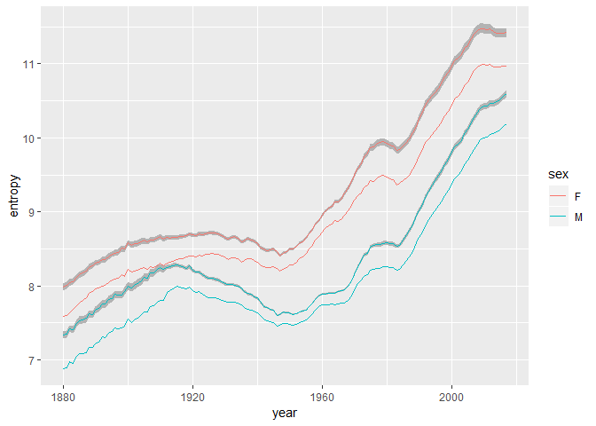

The [babynames](https://github.com/hadley/babynames) package/dataset is a great playground for using tidyverse skills to answer questions with data. In this post, I'll explore the dataset a little bit before diving into my main question ("How is name diversity changing over time?") and answering it using the [Shannon entropy](<https://en.wikipedia.org/wiki/Entropy_(information_theory)>) as a measure of diversity.

According to the link above, the `babynames` dataset contains: "For each year from 1880 to 2017, the number of children of each sex given each name. All names with more than 5 uses are given." (Actually all names with more than 4 uses are given.) The data comes from the US Social Security Administration. First, let's just get a feel for the data.


```r
library(babynames)
suppressMessages(library(tidyverse))
head(babynames)
```

```
## # A tibble: 6 x 5
##    year sex   name          n   prop
##   <dbl> <chr> <chr>     <int>  <dbl>
## 1  1880 F     Mary       7065 0.0724
## 2  1880 F     Anna       2604 0.0267
## 3  1880 F     Emma       2003 0.0205
## 4  1880 F     Elizabeth  1939 0.0199
## 5  1880 F     Minnie     1746 0.0179
## 6  1880 F     Margaret   1578 0.0162
```

Above, we can see the first few rows of the data. The `year`, `sex`, and `name` columns are self-explanatory. The `n` column records how many people had that name and sex in that year. The `prop` column is the proportion of people who had that name for the given year and sex. Since the data only contains names with more than 4 uses (per year and sex), the prop column does not sum to 1 (over a given year and sex). So we can see from the first row that of the girls born in 1880, 7065 were named Mary, which was about 7% of the female population born that year.

### A Look at Popular Names

Now, let's answer some questions. Let's find out which names were ever the most popular for a given year and sex, and how many times they were the most popular.


```r
babynames %>%
    filter(sex == "F") %>%
    group_by(year) %>%
    filter(n == max(n)) %>%
    ungroup() %>%
    count(name) %>%
    arrange(desc(nn))
```

```
## # A tibble: 10 x 2
##    name        nn
##    <chr>    <int>
##  1 Mary        76
##  2 Jennifer    15
##  3 Emily       12
##  4 Jessica      9
##  5 Lisa         8
##  6 Linda        6
##  7 Emma         5
##  8 Sophia       3
##  9 Ashley       2
## 10 Isabella     2
```

Here we have our answer for the girl's names. Mary was the top name for 76 years! The second most frequent top name is Jennifer, with only 15 years. Emily is close behind at 12 years as a top name. Let's do the boy's names now.


```r
babynames %>%
    filter(sex == "M") %>%
    group_by(year) %>%
    filter(n == max(n)) %>%
    ungroup() %>%
    count(name) %>%
    arrange(desc(nn))
```

```
## # A tibble: 8 x 2
##   name       nn
##   <chr>   <int>
## 1 John       44
## 2 Michael    44
## 3 Robert     17
## 4 Jacob      14
## 5 James      13
## 6 Noah        4
## 7 David       1
## 8 Liam        1
```

In this case, John and Michael are tied for the no. 1 spot with 44 years each. That's pretty interesting. I wonder if they went back and forth, or if each name had a distinct reign. Let's find out!


```r
babynames %>%
    filter(sex == "M", name %in% c("John", "Michael")) %>%
    ggplot(aes(year, prop, color = name)) +
    geom_line()
```

<!-- -->

Above, I've plotted the proportion of boys named John and Michael over time. We can see that John has been on a fairly steady decline, while Michael had a meteoric rise beginning some time in the 1930s, overtook John in popularity around 1950, and then started to decline around 1970. So it was definitely two distinct reigns.

Now we might like to see how the other top boy's names fared over time. Or how the graphs of the girl's names look. Or we might look into names that were never the most popular. We could keep asking questions and exploring the data for hours, but I just wanted to give you a taste of the data and the sorts of questions we can ask before changing gears and presenting my main topic.

### Entropy

I want to know if the distribution of names given to babies in a given year is getting more "diverse" or more "varied" over time. If we were dealing with a distribution over numbers, we could look at measures like the variance or interquartile range. For a categorical distribution, one measure stands out as a nice statistic: the entropy. 

The entropy of a random variable measures the average amount of information gained by observing one outcome of the variable. Suppose we've got a discrete random variable $X$ whose possible outcomes $x_1, \dots, x_k$ occur with probabilities $p_1, \dots, p_k$ respectively. Then the entropy of $X$ is

$$
H(X) = -\sum_{i = 1}^k p_i \log(p_i),
$$
where traditionally the logarithm is the base 2 logarithm, and entropy is measured in units of bits. Notice that the entropy only depends on the $p_i$ and not the $x_i$, so it is defined for any discrete random variable, whether categorical or numeric.

What does that formula have to do with information? Well, for a random event $A$ with probability $P(A)$, we can define the information of $A$ as 
$$
I(A) = \log(1/P(A)) = -\log(P(A)).
$$
This definition of information satisfies several intuitive and nice properties. If $A$ is very likely, then knowing that $A$ occurred doesn't give us much information. Another way to think about this is that we're not surprised when $A$ happens. On the other hand, if $A$ is very unlikely, then $A$ happening gives us lots of information. So we expect $I(A)$ to go up when $P(A)$ goes down and vice-versa. Since $1/P(A)$ satisfies this, and the logarithm is monotonic, $I(A)$ satisfies this. Moreover, if an event is a complete certainty, that is, if $P(A)=1$, then we get no information at all from knowing it happened, since we already knew it had to happen. In that case, we want $I(A) = 0$, and indeed it is. On the other hand, there's no limit to how surprised we could be by an event. The less likely the event is, the more surprising. So $I(A)$ should go to infinity as $P(A)$ goes to zero, and indeed it does. 

Finally, and this is the most important part, if $A$ and $B$ are independent events, and we observe both of them, then the total information we gained should just be the sum of the information gained from observing either one individually.
$$
I(AB) = I(A) + I(B)
$$
*Information is additive.* For $I(A)$ as we've defined it, this ends up being true precisely because the probability of both $A$ and $B$ occurring when they are independent is the product of their probabilities, and logarithms convert multiplication to addition.

Now for a random variable $X$ we can define a new random variable $I(X)$, the information gained upon observing $X$. For example if $X$ is very likely 1 and very rarely 0, and never anything else, then $I(X)$ is usually very small (the case when $X = 1$), but sometimes very large (the case when $X = 0$). The entropy $H(X)$ defined above is literally just $E(I(X))$, the average information. The entropy can also be motivated in terms of information theory as an upper bound for the amount lossless compression possible. I recommend the first part of the late David MacKay's excellent (and free!) book, [Information Theory, Inference, and Learning Algorithms](http://www.inference.org.uk/itprnn/book.html), if you'd like to learn all about this.

So why is entropy a good measure of the variability of a categorical random variable? Well, one nice result says that for a discrete random variable with $n$ possible outcomes, the entropy is maximized when each outcome is equally likely, in which case the variable is uniform and the entropy is $\log(n)$ bits. For example, if we have a binary random variable, then the entropy is always less than $\log(2) = 1$ bit, except when the variable's two outcomes are equally likely. So this essentially means that entropy goes up when probability is spread between as many potential outcomes as possible. That sounds like variability to me.

### The Entropy of Names

Now we're almost ready compute the entropy of names over time. But there's one problem. The data only includes names that were given five or more times. If we use the `prop` column, we don't have a proper probability distribution, so we'd only be getting a lower bound for the entropy. On the other hand, if we renormalized the `prop` column, the answer wouldn't be exact either. Maybe this is no big deal, but we should at least try to check that the error we're introducing isn't huge. 

It turns out we can actually bound the entropy above and below using some math tricks. Remember how I said that the information is additive where probability is multiplicative? It turns out that this property is inherited by the entropy, and it allows us to manipulate entropies just like probabilities, but converting every multiplication into addition. 

For example, the joint entropy $H(X, Y)$ is just the usual entropy of the joint distribution of $X$ and $Y$. The conditional entropy $H(X|Y)$ defined as the expectation over $y$ of $H(X|Y=y)$ which is just the usual entropy of the distribution of $X|Y=y$. It then turns out that we get an entropy chain rule
$$
H(X, Y) = H(X|Y) + H(Y)
$$

which looks an awful lot like the ordinary probability chain rule

$$
P(X, Y) = P(X|Y)P(Y).
$$

So here's what we do. We let $X$ be the name given to a randomly chosen child (of a given sex in a given year), and we let $Y$ be an indicator that's 1 if $X$ is in the data (occurred 5 or more times), and 0 otherwise. We want to bound $H(X)$ using information about $X|Y=1$. Rearranging the chain rule, we get the first equality below. Then $H(Y|X)$ is actually 0 since $Y$ is completely determined by $X$. We apply the chain rule again in the opposite order to $H(X, Y)$ to get the second equality. The final equality is just expanding the definition of conditional entropy.

$$
\begin{aligned}
H(X) &= H(X, Y) - H(Y|X) \\
&= H(X|Y) + H(Y) \\
&= H(X|Y=1)P(Y=1) + H(X|Y=0)P(Y=0) + H(Y)
\end{aligned}
$$

Now, $H(X|Y=1)$ is just the entropy of the renormalized `prop` column. $P(Y=1)$ is the sum of the `prop` column, which then gives us enough information to find both $P(Y=0)$ and $H(Y)$. The only term we don't know is $H(X|Y=0)$. From the `n` and `prop` columns we can figure out how many people are unaccounted for. Then the maximum entropy distribution for the names of those missing people is uniform, a unique name for each person. So the entropy would be $\log(m)$ where $m$ is the number of missing people. The minimum would be if they all had the same name, in which case the entropy would be zero. But we know that can't happen, since no name occurred more than 4 times for these people. So the minimum happens when every name occurred 4 times, except for at most one name which occurred either 1, 2, or 3 times. We can closely approximate this entropy as $\log(m/4)$.

Now we can finally compute and graph the entropy!


```r
# computes entropy of p where p is a normalized probability vector with no zero entries
entropy <- function(p) {
    -sum(p * log2(p))
}

entropy_babynames <- babynames %>%
    group_by(year, sex) %>%
    summarize(p = sum(prop),
              missing_ppl = sum(n) * (1 - p) / p,
              HY = entropy(c(p, 1-p)),
              entropy_lb = entropy(prop / p) * p + log(missing_ppl/4) * (1-p) + HY,
              entropy_ub = entropy(prop / p) * p + log(missing_ppl) * (1-p) + HY,
              entropy = (entropy_ub + entropy_lb) / 2,
              false_entropy1 = entropy(prop),   # ignore missing people
              false_entropy2 = entropy(prop/p)) # normalize and ignore

entropy_babynames %>%
    ggplot(aes(x = year)) +
    geom_ribbon(aes(ymin = entropy_lb, ymax = entropy_ub, group = sex), fill = "grey70") +
    geom_line(aes(y = entropy, color = sex))
```

<!-- -->

Above I've plotted the entropy by year and sex. The colored line is the midpoint of the upper and lower bounds, which are represented by the light grey ribbon. We can see right away that the bound are very tight. We can also see that girl's names tend to have more entropy than boy's names, but they track each other fairly closely. Both were increasing steadily until around 1920, at which point the entropy levels off and falls until around 1950, when it starts to rise very quickly. This could be due to the effects of the World Wars on the US birthrate. There's another small dip in the 1980s, and then a continued increase, though it looks like the name entropy for girls may be leveling off again. 

As for interpreting the general scale, the entropies we see here are roughly 10 bits. So that means the distribution of names (say, for baby girls born in 1980) has as much information content as a uniform random variable with 1024 unique outcomes. A quick check shows that there are well over 10,000 names for girls born in 1980, and of course, the distribution is very far from uniform. I'm not really sure what to make of this. I wonder how entropy relates to human memory. I bet if humans had 1024 uniformly distributed names, it would be harder to remember a random person's name on average. But I digress.

Lastly, let's see how far off the naive estimates of entropy are. In the first graph, we have the good estimates with the shaded bounds, and the estimate we get from computing the entropy on the unnormalized `prop` column. In the second graph, we computed the entropy by normalizing the `prop` column, but otherwise ignoring the missing people. The second estimate is clearly better, but neither is particularly good.


```r
entropy_babynames %>%
    ggplot(aes(x = year)) +
    geom_ribbon(aes(ymin = entropy_lb, ymax = entropy_ub, group = sex), fill = "grey70") +
    geom_line(aes(y = entropy, color = sex)) +
    geom_line(aes(y = false_entropy1, color = sex))
```

<!-- -->


```r
entropy_babynames %>%
    ggplot(aes(x = year)) +
    geom_ribbon(aes(ymin = entropy_lb, ymax = entropy_ub, group = sex), fill = "grey70") +
    geom_line(aes(y = entropy, color = sex)) +
    geom_line(aes(y = false_entropy2, color = sex))
```

<!-- -->
